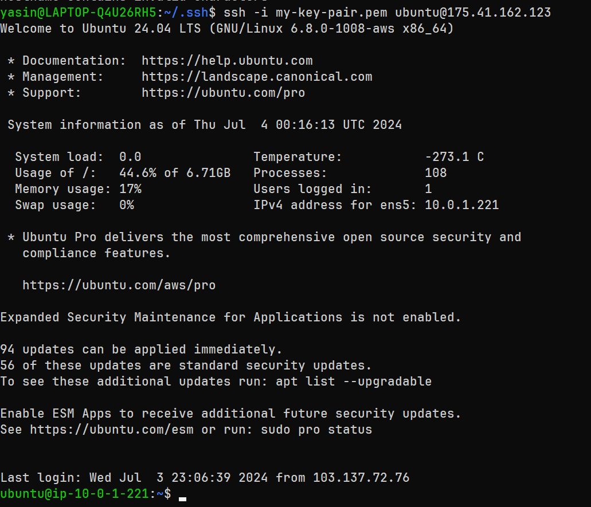

## SSH intro Git-Runner public instance

1. Open a Ubuntu terminal and change directory to your private key directory. Generally this directory is `~/.ssh`

```sh
cd ~/.ssh
```
2. Now Run this command to generate a pem file

```sh
cp ./id_rsa ./my-key-pair.pem
```
3. Now using this pem file SSH into the Git-runner Instance

```sh
ssh -i my-key-pair.pem ubuntu@<git-runner-instance-public-ip>
```



## Connect all private instances (Master Node, Worker Nodes) using a new key

1. Create a new rsa key

```sh
ssh-keygen -t rsa -b 2048
```

2. Run this command for ssh copying the Public key into remote instances

```sh
ssh-copy-id -i ~/.ssh/id_rsa.pub ubuntu@master-node-ip
ssh-copy-id -i ~/.ssh/id_rsa.pub ubuntu@worker-node-1-ip
ssh-copy-id -i ~/.ssh/id_rsa.pub ubuntu@worker-node-2-ip
```
3. Now you can ssh into any instances using this command:

```sh
ssh ubuntu@ubuntu@master-node-ip
ssh ubuntu@worker-node-1-ip
ssh ubuntu@worker-node-2-ip
```

## Run the ansible playbook for K3s installation

1. Goto ansible directory and run:

```sh
cd ansible
ansible-playbook -i inventory/hosts.ini site.yml
```
This will install k3s in the master node ec2 and connect the worker node ec2 as a worker node.

```sh
ubuntu@ip-10-0-1-221:~/ansible$ ansible-playbook -i inventory/hosts.ini site.yml

PLAY [k3s_cluster] *******************************************************************************************************************************

TASK [Gathering Facts] ***************************************************************************************************************************
ok: [master-node]
ok: [worker-node-2]
ok: [worker-node-1]

TASK [common : Update and upgrade apt packages] **************************************************************************************************
changed: [master-node]
changed: [worker-node-1]
changed: [worker-node-2]

TASK [common : Install dependencies] *************************************************************************************************************
changed: [worker-node-2]
changed: [master-node]
changed: [worker-node-1]

PLAY [master] ************************************************************************************************************************************

TASK [Gathering Facts] ***************************************************************************************************************************
ok: [master-node]

TASK [k3s-master : Download and install k3s] *****************************************************************************************************
changed: [master-node]

TASK [k3s-master : Set file permission] **********************************************************************************************************
changed: [master-node]

TASK [k3s-master : Get k3s token] ****************************************************************************************************************
ok: [master-node]

TASK [k3s-master : Get master node IP] ***********************************************************************************************************
ok: [master-node]

PLAY [workers] ***********************************************************************************************************************************

TASK [Gathering Facts] ***************************************************************************************************************************
ok: [worker-node-2]
ok: [worker-node-1]

TASK [k3s-worker : Join the k3s cluster] *********************************************************************************************************
changed: [worker-node-1]
changed: [worker-node-2]

PLAY RECAP ***************************************************************************************************************************************
master-node                : ok=8    changed=4    unreachable=0    failed=0    skipped=0    rescued=0    ignored=0
worker-node-1              : ok=5    changed=3    unreachable=0    failed=0    skipped=0    rescued=0    ignored=0
worker-node-2              : ok=5    changed=3    unreachable=0    failed=0    skipped=0    rescued=0    ignored=0

ubuntu@ip-10-0-1-221:~/ansible$
```
## varification
You can also check if k3s is installed successfull or not.
1. SSH into Masternode
```sh
ssh ubuntu@master-node-ip
```
2. Now you are in the master node instance. Run this command
```sh
kubectl get nodes
```


here we can see, one master node and two worker node.

So we have deployed k3s using ansible automation from the Control node(Git-runner)